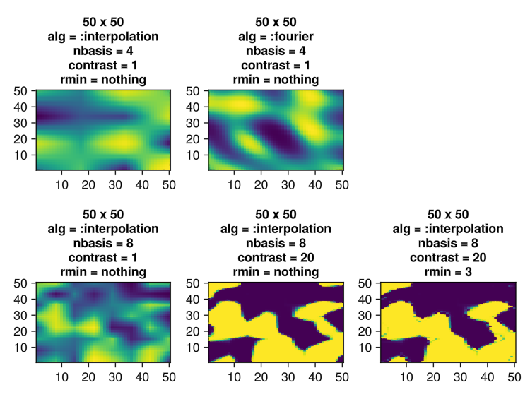
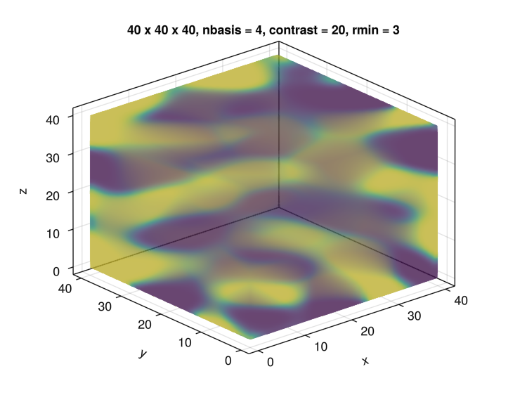
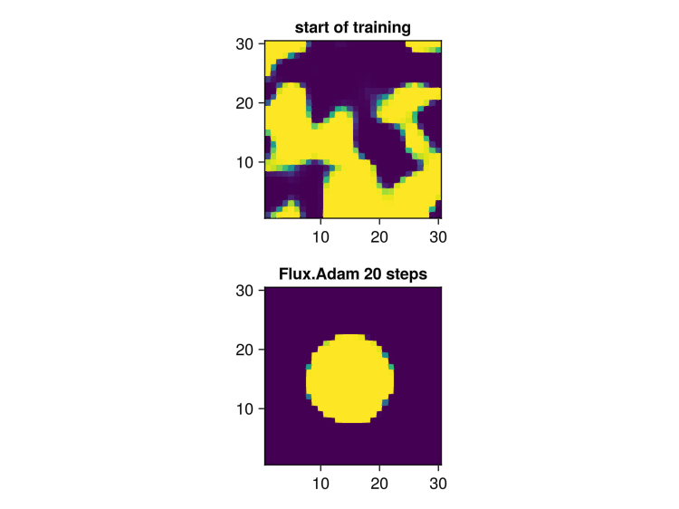

# Jello.jl

Please install directly from repo `]add https://github.com/paulxshen/Jello.jl`. The general registry  version is lagging 

## Manufacturable geometry generation for topology optimization & generative design
We design a parameter efficient, fully differentiable, length scale controlled Fourier  geometry generator for topology optimization & generative inverse design. It uses Fourier domain basis combined with real space morphological filtering. First, it approximately bound length scales in any dimension by deriving real space geometry from a compact Fourier k-space of spatial frequencies via the inverse Fourier transform. Next, it applies optional morphological filtering to exactly eliminate undesirable thin features, close spacings and tight bends that hamper manufacturability or induce checkerboard instability.  Adjustable sigmoid  nonlinearity is used to control edge sharpness and induce stable bounded values and adjoint gradients without an extraneous non-binary density penalty function.

## Usage
```julia
using Random, GLMakie, LinearAlgebra
using Jello

fig2d = Figure()
l = 100

Random.seed!(1)
nbasis = 4
contrast = 1
rmin = nothing
m = FourierBlob(l, l; nbasis, contrast)
heatmap(fig2d[1, 1], m(); axis=(; title="$l x $l\nnbasis = $nbasis\ncontrast = $contrast\nrmin = $rmin"))

Random.seed!(1)
nbasis = 6
m = FourierBlob(l, l; nbasis, contrast)
heatmap(fig2d[2, 1], m(); axis=(; title="$l x $l\nnbasis = $nbasis\ncontrast = $contrast\nrmin = $rmin"))

Random.seed!(1)
contrast = 20
m = FourierBlob(l, l; nbasis, contrast)
heatmap(fig2d[2, 2], m(); axis=(; title="$l x $l\nnbasis = $nbasis\ncontrast = $contrast\nrmin = $rmin"))

Random.seed!(1)
rmin = :auto
m = FourierBlob(l, l; nbasis, contrast, rmin)
heatmap(fig2d[2, 3], m(); axis=(; title="$l x $l\nnbasis = $nbasis\ncontrast = $contrast\nrmin = :$rmin"))

Random.seed!(1)
rmin = 3
m = FourierBlob(l, l; nbasis, contrast, rmin)
heatmap(fig2d[2, 4], m(); axis=(; title="$l x $l\nnbasis = $nbasis\ncontrast = $contrast\nrmin = $rmin"))

save("samples2d.png", fig2d)
fig2d

Random.seed!(1)
l = 40
nbasis = 4
contrast = 20
m = FourierBlob(l, l, l; nbasis, contrast,)
fig3d = volume(m(); algorithm=:absorption, axis=(; type=Axis3, title="$l x $l x $l, nbasis = $nbasis, contrast = $contrast, rmin = $rmin"))
save("samples3d.png", fig3d)
fig3d
```




## Adjoint optimization
In real applications, our geometry generator would interface with a FEM or FDM solver that computes a loss function against a target metric. For gradient based adjoint optimization, the solver needs to be amenable to automatic differentiation or have hard coded adjoints. For the sake of testing `Jello.jl`, we pretend we know the optimal geometry (eg circle) and verify that `Jello.jl` can reach it through gradient descent.
```julia
using Test, Random, Flux, GLMakie, LinearAlgebra, StatsBase
using Flux: gradient, withgradient
using AbbreviatedStackTraces
using Jello

Random.seed!(1)
l = 50
y = float.([norm([x, y] - [l, l] / 2) < l / 4 for x = 1:l, y = 1:l]) # circle
model = FourierBlob(l, l; nbasis=4, contrast=20,)
# model = FourierBlob(l, l; nbasis=4, contrast=20, rmin=:auto)
iterations = 100

fig = Figure()
empty!(fig)
aspect = 1
heatmap(fig[1, 1], model(), axis=(; aspect, title="start of training"))

loss(model) = mean(abs, y - model())

# train
opt = Adam(0.5)
opt_state = Flux.setup(opt, model)
for i = 1:iterations
    l, (dldm,) = withgradient(loss, model)
    Flux.update!(opt_state, model, dldm)
    i % 10 == 0 && println("$i $l")
end

heatmap(fig[2, 1], model(), axis=(; title="Flux.Adam $iterations steps", aspect))
display(fig)
```


## Collaboration
Open to collaboration and consulting. LMK if you need the package in Pytorch or JAX, or wish to try it out on an adjoint FEM solver. We can also interface with solvers in C or other languages by passing the Jacobian.

## Contributing
Consider sponsoring this package if you found this repo helpful. Feel free to request features or contribute PRs :)
