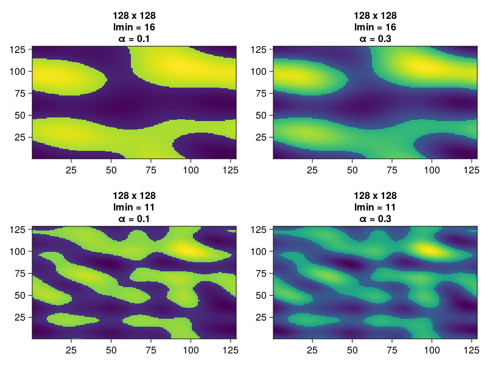
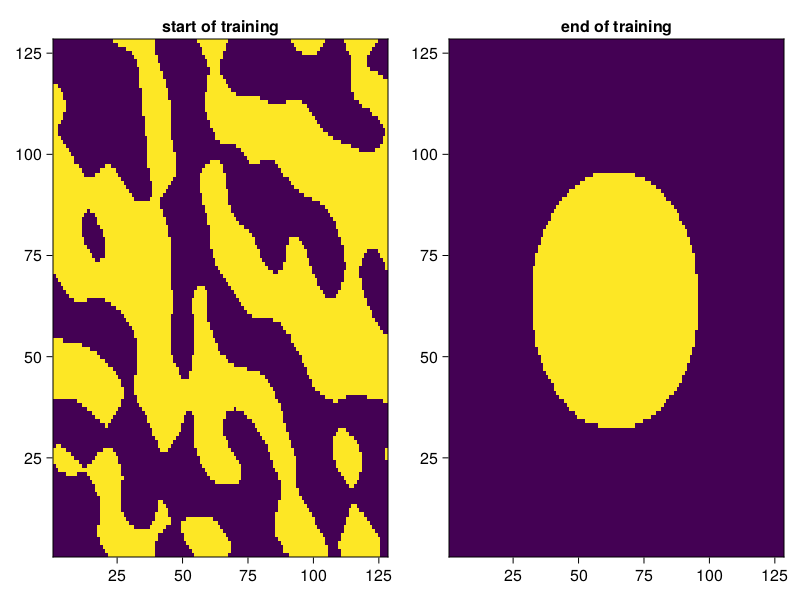

# Jello.jl

## Manufacturable geometry generation for topology optimization & generative design
We design a differentiable Fourier domain algorithm for generating manufacturable geometry in topology optimization & generative inverse design. We approximately bound length scales in any dimension by deriving real space geometry from a Fourier k-space of spatial frequencies via the inverse Fourier transform. This reduces undesirable thin features, close spacings and tight bends that hamper manufacturability or induce checkerboard instability.  We use an adjustable step nonlinearity to induce stable bounded adjoint gradients without an extraneous non-binary density penalty function.

## Usage
<!-- ## Usage -->
```julia
using Jello, Random
Random.seed!(1)

l = 128
sz = (l, l)
lmin = 16
m = Mask(sz, lmin)

α = 0.1
a = m(α)
```

## Adjoint optimization
In real applications, our geometry generator would interface with a FEM or FDM solver that computes a loss function against a target metric. For gradient based adjoint optimization, the solver needs to be amenable to automatic differentiation or have hard coded adjoints. For the sake of testing `Jello.jl`, we pretend we know the optimal geometry (eg circle) and verify that `Jello.jl` can reach it through gradient descent.
```julia
using Random, Flux, CairoMakie, LinearAlgebra
using Jello
Random.seed!(1)

l = 128
y = float.([norm([x, y] - [l, l] / 2) < l/4 for x = 1:l, y = 1:l]) # circle
loss(m) = Flux.mae(m(0.1), y)

m = Mask((l, l), l / 16)
opt = Adam(0.1)
opt_state = Flux.setup(opt, m)

fig = Figure()
heatmap(fig[1, 1], m(0), axis=(; title="start of training"))
for i = 1:100
    Flux.train!(m, [[]], opt_state) do m,_
        l = loss(m)
        println(l)
        l
    end
end
heatmap(fig[1, 2], m(0), axis=(; title="end of training"))
display(fig)
```

## Collaboration
LMK if you try it out on an adjoint FEM solver. We can also interface with solvers in C or other languages by passing the Jacobian.
## Contributing
Consider supporting on [Patreon](https://patreon.com/pxshen?utm_medium=clipboard_copy&utm_source=copyLink&utm_campaign=creatorshare_creator&utm_content=join_link) if you found this repo helpful. Feel free to request features or contribute PRs :)
